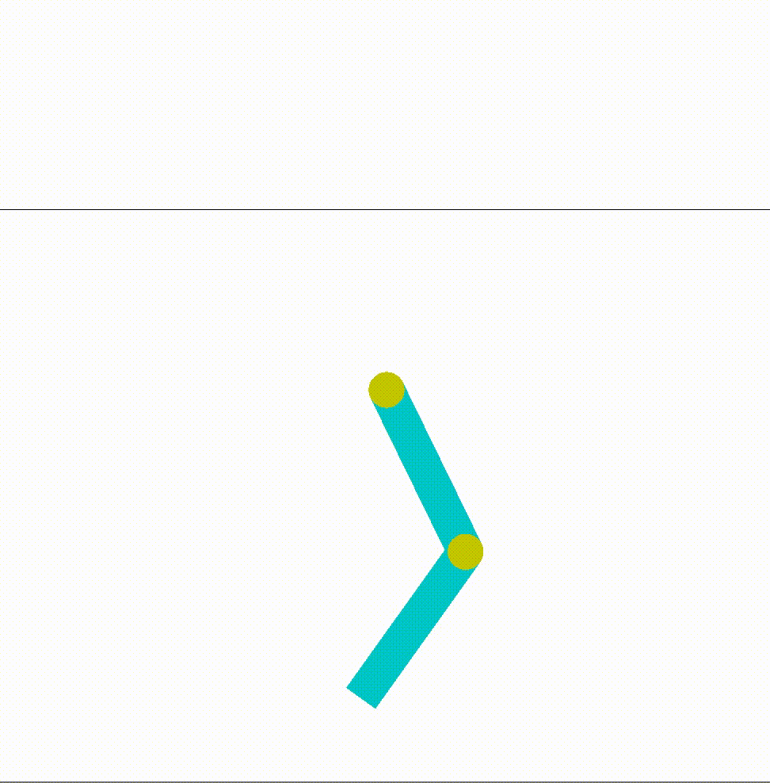

# Acrobat v1 - OpenAI Gym

I consider the agent trained when it can reach the line in 100 steps (on average of 30 episodes)

* Time to train: about 8 min
* Episodes **100-320**
* Using **DDQN** (Double Deep Q Network)

#### Reward
~~~
reward = 100 if line_reached else -link1_cos
~~~

#### Network
~~~
_________________________________________________________________
Model: "sequential_1"
_________________________________________________________________
Layer (type)                 Output Shape              Param #   
=================================================================
dense_4 (Dense)              (None, 24)                168       
_________________________________________________________________
dense_5 (Dense)              (None, 64)                1600      
_________________________________________________________________
dense_6 (Dense)              (None, 24)                1560      
_________________________________________________________________
dense_7 (Dense)              (None, 3)                 75        
=================================================================
~~~
